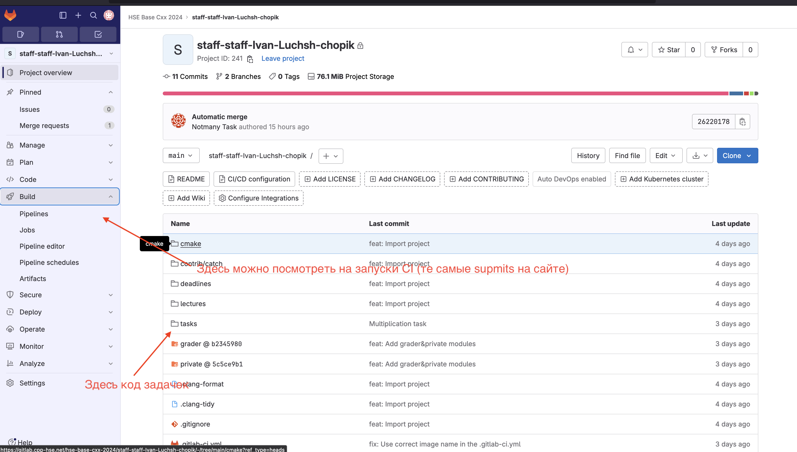
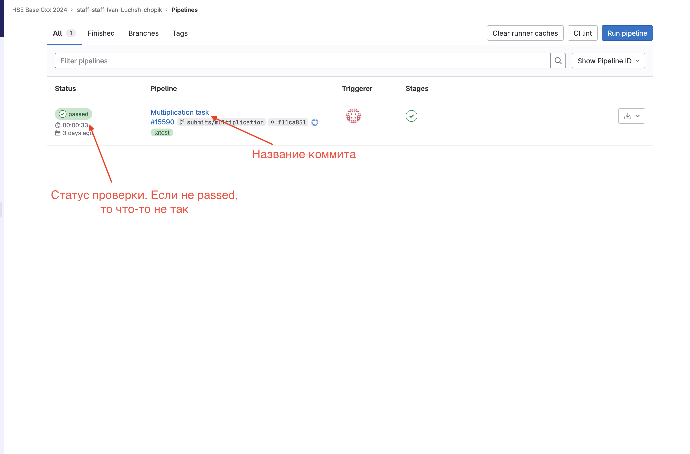

# Семинарист: Лущ Иван
# Ассистент: Турулин Захар
---
# Чат в телеграме

https://t.me/+Gy77joNj6AQ0MmQ6
---
---
# Репозиторий с материалами семинаров

https://github.com/Ch0p1k3/cpp-ami-2023/tree/main
---
---
# Система для сдачи задач
Сайт: https://base.cpp-hse.net/signup
Секретный код сейчас кину в телеграме

---
---
# Интерфейс base.cpp-hse.net

---
---
# GitLab repo

---
---
# Страница запущенных пайплайнов (submits)

---
---
# Операционная система (ОС)
Тем у кого Linux, MacOS ничего делать дополнительно не нужно. А тем у кого Windows, то советую поставить WSL.

Ссылка на мой рассказ для пользователей Windows: https://github.com/Ch0p1k3/cpp-ami-2023/blob/main/etc/wsl.md
---
---
# Семинарская оценка

Формула оценки: 0.25 * домашние задания + 0.25 * проект + 0.2 * КР + 0.1 * Экзамен + 0.1 * Семинарская оценка

Решил, что буду делать квизы (на 3-5 минут(ы)) в начале (конце) наших семинаров.
