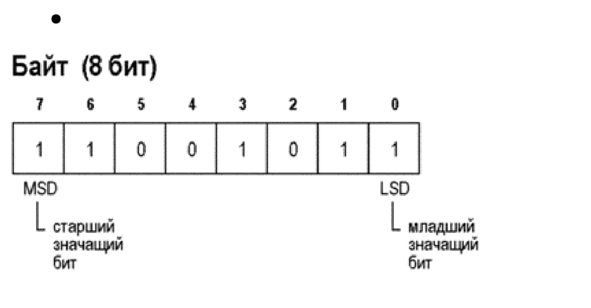

<style>
img[alt~="center"] {
  display: block;
  margin: 0 auto;
}
header h1 {
    margin-top:0;
    margin-left:15px
}
</style>

# Представление целых чисел
---
# Байты и октеты
- Обычно, мы мы говорим байт, и имеем в виду под этим 8 бит, но это не так
- В стандарте С++ байт это `char`, минимально адресуемая единица памяти
- Количество бит в `char` определяется константой `CHAR_BIT`, но `CHAR_BIT` в стандарте `>= 8`.
- А есть слово "октет" - это всегда 8 бит.
---
# Sizeof operator
```cpp
sizeof( type )
sizeof expression
```
`sizeof` - возвращает размер типа или объекта
[sizeof.cpp](code/sizeof.cpp)
---
---
# Целые типы с разным количеством битов в зависимости от окружения
- `short` - как минимум 16 бит
- `int` - как минимум 16 бит
- `long` - как минимум 32 бита
- `long long` - как минимум 64 бита

`signed`, `unsigned` - знаковый или беззнаковый тип. Если у вышеперечисленных не указывать явно эти ключевые слова, то будет `signed`.
---
---
# Целые типы, которые лучше использовать
- `cstdint` - `intN_t`, `uintN_t`.
- `cinttypes` - [I/O макросы](https://en.cppreference.com/w/cpp/header/cinttypes).
[cinttypes.cpp](code/cinttypes.cpp)
---
# Разряды

---
---
# Знаковые целые числа
- Надо где-то хранить знак числа
- Стандарт С++ допускает три типа представления чисел:
  - Прямой код ()
  - Обратный код
  - Дополнительный код
---
# Прямой код
<style scoped>
table {
    height: 100%;
    width: 100%;
    font-size: 10px;
}
</style>
Положительное | Двоичное | Прямой код
--- | --- | ---
0 | 0000 | 0
1 | 0001 | 1
2 | 0010 | 2
3 | 0011 | 3
4 | 0100 | 4
5 | 0101 | 5
6 | 0110 | 5
7 | 0111 | 7
8 | 1000 | -0
9 | 1001 | -1
10 | 1010 | -2
11 | 1011 | -3
12 | 1100 | -4
13 | 1101 | -5
14 | 1110 | -6
15 | 1111 | -7
---
# Обратный код
<style scoped>
table {
    height: 100%;
    width: 100%;
    font-size: 10px;
}
</style>
Положительное | Двоичное | Прямой код
--- | --- | ---
0 | 0000 | 0
1 | 0001 | 1
2 | 0010 | 2
3 | 0011 | 3
4 | 0100 | 4
5 | 0101 | 5
6 | 0110 | 5
7 | 0111 | 7
8 | 1000 | -7
9 | 1001 | -6
10 | 1010 | -5
11 | 1011 | -4
12 | 1100 | -3
13 | 1101 | -2
14 | 1110 | -1
15 | 1111 | -0
---
# Дополнительный код
<style scoped>
table {
    height: 100%;
    width: 100%;
    font-size: 10px;
}
</style>
Положительное | Двоичное | Прямой код
--- | --- | ---
0 | 0000 | 0
1 | 0001 | 1
2 | 0010 | 2
3 | 0011 | 3
4 | 0100 | 4
5 | 0101 | 5
6 | 0110 | 5
7 | 0111 | 7
8 | 1000 | -8
9 | 1001 | -7
10 | 1010 | -6
11 | 1011 | -5
12 | 1100 | -4
13 | 1101 | -3
14 | 1110 | -2
15 | 1111 | -1
---
# Дополнительный код
- $-x =$ ~$x + 1$
- $\left[-2^{n - 1}, 2^{n - 1}\right)$ - диапазон, где $n$ - количество байт в типе
- $-0_{10} = 0_{10}$, докажем для 4 битного типа
  $-0_{10} = ~0_{10} + 1 = 1111_{2} + 1_{2} = 0000_{2} = 0$
- Операции сложения и вычитания n-битных беззнаковых чисел дают правильный результат для знаковый чисел.
---
# Дополнительный код
- Переполнение знакового числа это undefined behavior
- `-fwrapv` – выполнять знаковые операции по
модулю 2^N, но компилятор не делает
никаких оптимизационных предположений
- `-fsanitize=undefined` – проверка на undefined
behavior при работе программы
---
# Char
- `char` - может быть либо знаковым, либо беззнаковым (implementation defined behavior)
- Можно переключаться между режимами, через `-fsigned-char`, `-funsigned-char`. (точно работает в `clang++`, `g++`)

[char.cpp](code/char.cpp)
---
---
# Максимальные и минимальные значения типов
- [C++ style](https://en.cppreference.com/w/cpp/types/numeric_limits)
- `#include <limits>`
- `std::numeric_limits<type>`
- [C style](https://en.cppreference.com/w/cpp/types/climits)
- `#include <climits>`
- `CHAR_BIT, MB_LEN_MAX, CHAR_MIN, CHAR_MAX, SCHAR_MIN, SHRT_MIN, INT_MIN, LONG_MIN, LLONG_MIN, SCHAR_MAX, SHRT_MAX, INT_MAX, LONG_MAX, LLONG_MAX, UCHAR_MAX, USHRT_MAX, UINT_MAX, ULONG_MAX, ULLONG_MAX, PTRDIFF_MIN, PTRDIFF_MAX, SIZE_MAX, SIG_ATOMIC_MIN, SIG_ATOMIC_MAX, WCHAR_MIN, WCHAR_MAX, WINT_MIN, WINT_MAX`
---
---
# Представление вещественных чисел
