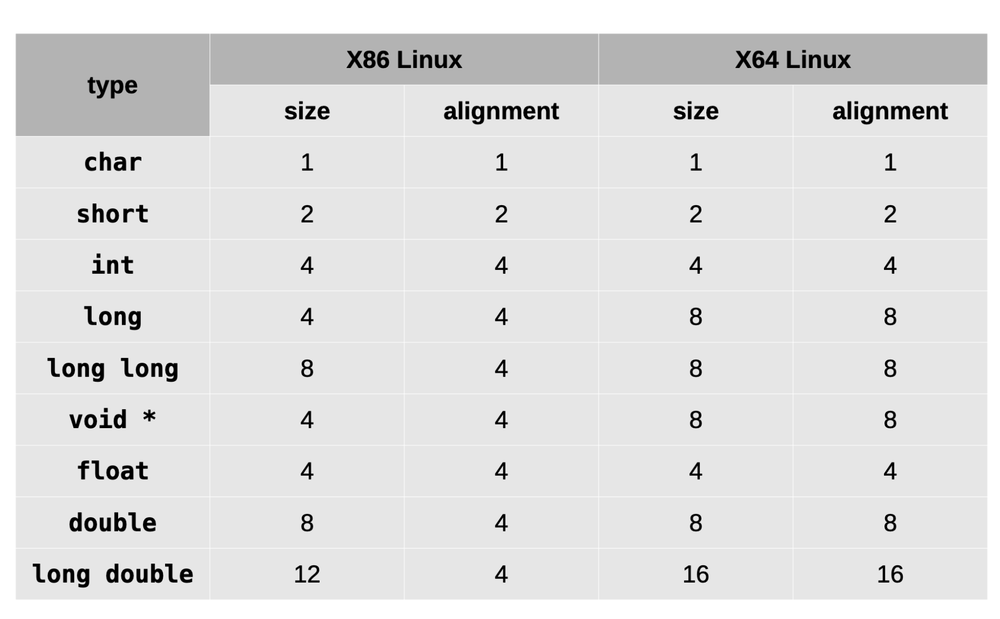

# Приоритеты операторов

- https://en.cppreference.com/w/cpp/language/operator_precedence
---
# Текстовая информация
- Представление строки - это последовательность байт.
- `char[]`, где в конце ставится `\0` байт, который является нулевым байтом и обозначает конец строки.
- [`cstring`](https://en.cppreference.com/w/cpp/header/cstring) - работа со строками, которая пришла с `C`.
- в `C++` пользуются [`std::string`](https://en.cppreference.com/w/cpp/string) классом
---
# Выравнивание
- Выравнивание - гарантирует размерещение переменной так, чтобы адрес размещения был кратен размеру выравнивания
---
# Невыровненные данные
- На некоторых платформах вызывает `Bus Error`
- Обращение к невыровненным данным требует два цикла обращения к памяти вместо одного
- `Undefined behavior`
---
# Sizeof & alignof

